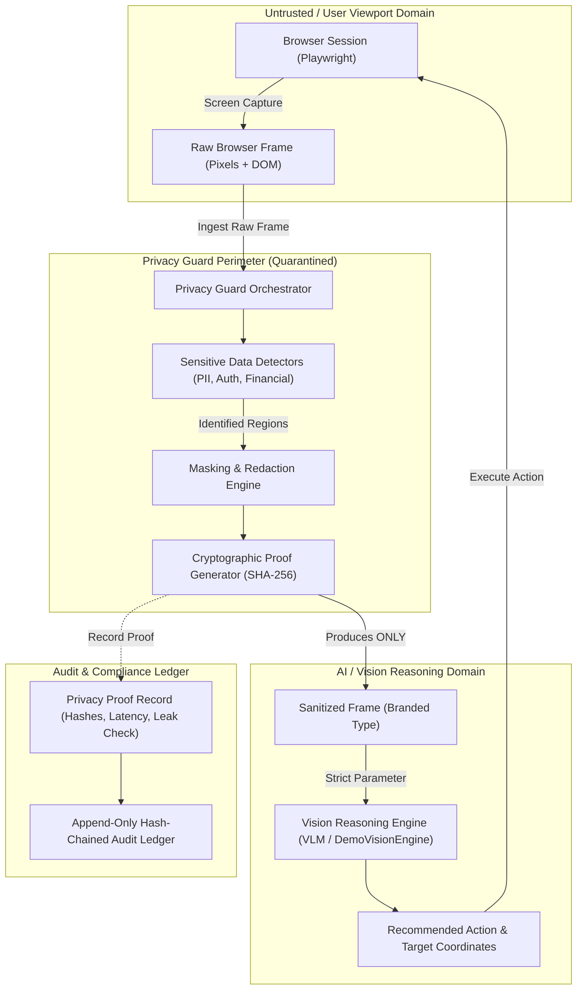

# Drishti // System Architecture Specification
**Privacy-Preserving Browser Vision Agent**  
*Team Aurelis &bull; Smart India Hackathon 2026 Prototype*

---

## 1. Executive Summary & Vision

Modern autonomous browser agents operate by taking screenshots of the user's browser viewport and streaming those visual frames directly to large multimodal vision models (VLMs). In sensitive real-world workflows—such as banking, healthcare portals, government citizen services, enterprise ERPs, and confidential corporate communications—this architecture represents an unacceptable security and privacy vulnerability: **raw, unredacted visual pixels containing PII, credentials, financial details, and session tokens are exposed to the AI inference provider.**

**Drishti** fundamentally re-architects the browser agent visual pipeline. It introduces an explicit, cryptographically verifiable, and non-bypassable **Privacy Guard Perimeter** between the browser session and the vision reasoning engine. Before any visual data or text representation is transmitted to the AI, visual and contextual privacy analysis detects sensitive regions, applies solid/blur masks, and generates a non-repudiable audit proof.

---

## 2. Core Architectural Pipeline & The Privacy Boundary

The critical architectural invariant of Drishti is:
> **The Vision/AI reasoning layer must NEVER consume or have access to raw browser frames.**

### Conceptual Pipeline
```
USER TASK
  ↓
TASK MANAGER / PLANNER
  ↓
BROWSER SESSION (Playwright / Viewport)
  ↓
[RAW BROWSER FRAME] ───► (QUARANTINED WITHIN LOCAL MEMORY)
  ↓
PRIVACY GUARD PERIMETER
  ├── Sensitive Region Detection (DOM heuristics, Regex, OCR, NER)
  ├── Cryptographic Hashing of Raw Payload (SHA-256)
  └── Masking / Redaction (Solid fill / Blur / Token replacement)
  ↓
[SANITIZED FRAME] ─────► (CRYPTOGRAPHICALLY VERIFIED)
  ↓
VISION / AI ENGINE (Target Grounding & Visual Understanding)
  ↓
ACTION PLANNER
  ↓
BROWSER ACTION EXECUTOR (Click, Type, Scroll)
  ↓
VERIFICATION
  ↓
TAMPER-EVIDENT AUDIT LEDGER (Hash-chained log & Privacy Proofs)
```

### The Strict Privacy Boundary Diagram



---

## 3. Enforcing the Boundary: Type Branding & Cryptographic Proofs

To prevent developers or autonomous modules from accidentally bypassing the privacy boundary, Drishti enforces the perimeter at two independent levels:

### 3.1 Type-Level Enforcement (Nominal Branding)
In `@drishti/core`, raw frames and sanitized frames are declared with unique brands:

```typescript
export interface RawBrowserFrame {
  readonly _brand: 'RawBrowserFrame';
  readonly frameId: string;
  readonly timestamp: number;
  readonly imageBase64: string;
  readonly width: number;
  readonly height: number;
  readonly sourceUrl: string;
  readonly domTextSnapshot?: string;
}

export interface SanitizedFrame {
  readonly _brand: 'SanitizedFrame';
  readonly frameId: string;
  readonly timestamp: number;
  readonly sanitizedImageBase64: string;
  readonly width: number;
  readonly height: number;
  readonly redactionsApplied: readonly RedactionRecord[];
  readonly verificationDigest: string; // SHA-256 of sanitized payload
  readonly rawFrameDigest: string;     // SHA-256 of raw frame
  readonly sanitizedAt: number;
  readonly privacyGuardVersion: string;
}
```

The `VisionEngine` interface strictly accepts only `SanitizedFrame`:
```typescript
export interface VisionEngine {
  readonly engineId: string;
  processSanitizedFrame(
    frame: SanitizedFrame,
    prompt: VisionGoalPrompt
  ): Promise<VisionAnalysisResult>;
}
```
Attempting to pass a `RawBrowserFrame` directly into `processSanitizedFrame()` results in a compile-time TypeScript error:
`Type '"RawBrowserFrame"' is not assignable to type '"SanitizedFrame"'`.

### 3.2 Runtime Verification & Cryptographic Digest
Even at runtime:
1. `PrivacyGuard.sanitizeFrame()` computes a SHA-256 digest of the raw frame (`rawFrameDigest`) and of the sanitized output (`verificationDigest`).
2. `DemoVisionEngine.processSanitizedFrame()` executes runtime type guard `isSanitizedFrame(frame)`. If the object was not created by the guard or has been tampered with, execution immediately rejects with a `SECURITY VIOLATION`.
3. Every sanitization cycle logs an immutable `PrivacyProofRecord` containing:
   - Sensitive regions detected count
   - Redactions applied count
   - Verified flag: `directRawFrameToAiBlocked: true`
   - Latency in milliseconds.

---

## 4. Repository Structure & Module Decomposition

```
drishti/
├── apps/
│   ├── api/                     # Backend API & WebSocket orchestration server
│   │   ├── src/
│   │   │   ├── controllers/     # Health, privacy verification, audit controllers
│   │   │   ├── routes/          # API routes (/api/health, /api/privacy, /api/audit)
│   │   │   ├── server.ts        # Express application factory
│   │   │   └── index.ts         # Server entry point (port 3001)
│   │   ├── package.json
│   │   └── tsconfig.json
│   └── web/                     # Frontend Command Center (React + Vite + TypeScript)
│       ├── src/
│       │   ├── components/      # Pipeline diagram, Status grid, Test bench, Audit stream
│       │   ├── styles/main.css  # Dark AI command center design system
│       │   ├── App.tsx          # Root application coordinator
│       │   └── main.tsx         # Client entry point (port 3000)
│       ├── index.html
│       ├── package.json
│       ├── tsconfig.json
│       └── vite.config.ts
├── packages/
│   ├── core/                    # Canonical domain contracts, branded types, and models
│   │   ├── src/
│   │   │   ├── types/           # privacy, vision, browser, task, audit types
│   │   │   └── index.ts
│   │   ├── package.json
│   │   └── tsconfig.json
│   ├── privacy-guard/           # Privacy Guard service (detection, redaction, hashing)
│   │   ├── src/
│   │   │   ├── detector.ts      # Rule-based regex & SIH synthetic test detector
│   │   │   ├── redactor.ts      # Redaction engine with SHA-256 digest generation
│   │   │   ├── privacy-guard.ts # Boundary coordinator
│   │   │   └── index.ts
│   │   ├── package.json
│   │   └── tsconfig.json
│   ├── vision-engine/           # Vision Reasoning layer (strictly consumes SanitizedFrame)
│   │   ├── src/
│   │   │   ├── demo-vision-engine.ts # Explicitly named DemoVisionEngine
│   │   │   └── index.ts
│   │   ├── package.json
│   │   └── tsconfig.json
│   └── audit-logger/            # Tamper-evident hash-chained audit ledger
│       ├── src/
│       │   ├── audit-logger.ts  # Append-only hash chain and proof ledger
│       │   └── index.ts
│       ├── package.json
│       └── tsconfig.json
├── python/                      # Python ML service foundation (for OCR / Presidio / VLMs)
│   ├── pyproject.toml
│   ├── requirements.txt
│   └── README.md
├── tests/                       # Automated unit and integration tests
│   ├── privacy-boundary.test.ts # Boundary leakage & brand verification tests
│   ├── audit-logger.test.ts     # Hash chaining & proof storage tests
│   └── api-health.test.ts       # Full API integration tests
├── docs/
│   └── ARCHITECTURE.md          # This document
├── .gitignore
├── package.json                 # Monorepo root with npm workspaces
├── tsconfig.base.json           # Shared strict TypeScript configuration
└── README.md
```

---

## 5. Component Maturity Matrix (Real vs Planned)

In accordance with strict hackathon engineering integrity:

| Component | Package / Module | Status | Role & Current Capability |
| :--- | :--- | :--- | :--- |
| **Domain Contracts** | `@drishti/core` | **REAL** | Branded types (`RawBrowserFrame`, `SanitizedFrame`), interface definitions, runtime type guards. |
| **Privacy Guard** | `@drishti/privacy-guard` | **REAL** | Pattern-based PII detector, SIH benchmark rule engine, redactor, cryptographic digest calculator. |
| **Audit Ledger** | `@drishti/audit-logger` | **REAL** | Append-only event store with SHA-256 event chaining and privacy proof registration. |
| **Backend API Gateway** | `apps/api` | **REAL** | Express server with health monitoring, live synthetic verification endpoint, and audit logs. |
| **Command Center UI** | `apps/web` | **REAL** | React + Vite dark command console with live verification bench and architecture flow visualization. |
| **Vision Engine** | `@drishti/vision-engine` | **SIMULATED** | `DemoVisionEngine`: Simulates visual grounding; strictly enforces `SanitizedFrame` input. |
| **Browser Controller** | `services/browser-agent` | **PLANNED** | Playwright headless/headed browser session controller (Phase 2). |
| **Task Planner** | `services/task-planner` | **PLANNED** | Multi-step goal decomposition and action state machine (Phase 4). |
| **Deep ML PII Engine** | `python/` | **PLANNED** | Python Presidio + EasyOCR microservice for deep image-level OCR and NER (Phase 3). |

---

## 6. Technology Selection Rationale

| Technology | Role | Rationale |
| :--- | :--- | :--- |
| **TypeScript (v5.7)** | Language across Core, API, Packages, Frontend | Enables compile-time branded type safety to guarantee privacy boundary enforcement. Zero runtime overhead for type checks. |
| **Node.js (v24)** | Backend & Core Runtime | Fast execution, native `crypto`, built-in test runner (`node --test`), native `fetch`, standard across Windows environments. |
| **npm Workspaces** | Monorepo Orchestration | Built into npm 11; avoids heavy monorepo tooling (Lerna, Nx) while enabling zero-link cross-package development. |
| **Express.js** | Backend API Gateway | Minimal, robust, universally dependable on Windows, zero configuration hurdles. |
| **React 18 + Vite 6** | Frontend Command Center | Instant Hot Module Replacement (HMR), sub-millisecond dev server startup, clean production bundling. |
| **Custom CSS Design System** | UI Styling | Tailored obsidian/charcoal theme (`--bg-primary`, `--border-subtle`, `--accent-cyan`), avoids generic dashboard boilerplate. |
| **Playwright (Planned)** | Browser Automation | Most stable cross-browser automation library for Chromium, Firefox, WebKit with reliable screenshot capture. |
| **Python 3.13 (Configured)** | ML & OCR Service Foundation | Industry standard for computer vision (OpenCV, EasyOCR) and NLP PII detection (Microsoft Presidio). |

---

## 7. Synthetic Benchmark Specification (SIH 2026 Test Page)

To demonstrate the privacy agent to judges without exposing real private data, Drishti defines a standard synthetic benchmark test suite:
- **Synthetic Name**: `AURELIS_TEST_NAME`
- **Synthetic Email**: `test@example.local`
- **Synthetic Phone**: `+91 9000000000`
- **Synthetic Token**: `AURELIS-ID-12345`

### Acceptance Criteria for Verification:
1. `rawInputSnapshot` contains the plaintext benchmark entities.
2. `sanitizedTextSnapshot` replaces all entities with `[REDACTED:<CATEGORY>]`.
3. `sanitizedFramePayload` contains non-empty `redactionsApplied` with matching categories.
4. `visionEngineResponse` confirms `rawFrameBypassed === false`.
5. `proofOfPrivacy` contains matching SHA-256 verification digest and records `directRawFrameToAiBlocked === true`.

---

## 8. Future Roadmap & Extension Points

- **Phase 2 (Browser Session Automation)**: Implement `services/browser-agent` using Playwright to launch isolated browser sessions and stream viewport screenshots into `PrivacyGuard`.
- **Phase 3 (Deep PII & OCR Detection)**: Connect Python ML service for pixel-level optical character recognition (OCR) and named-entity recognition (NER) for images and canvas elements.
- **Phase 4 (Autonomous Planning & Action Verification)**: Implement multi-step planner capable of evaluating whether the previous browser action achieved its desired state change.
